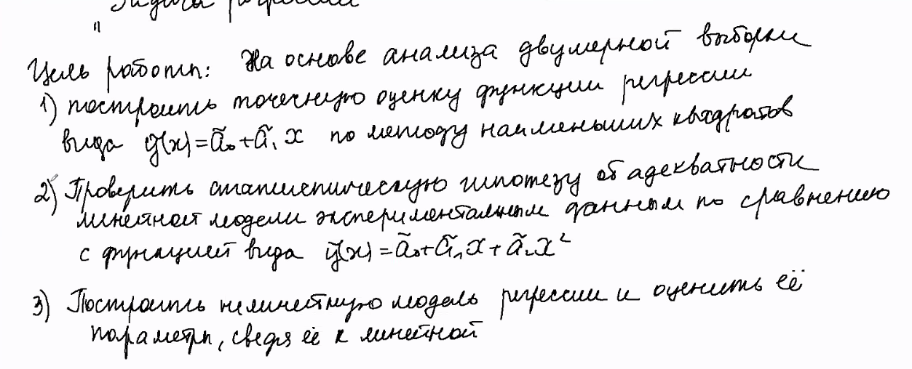

# 4 семестр

## Администрирование в ОС Windows Server

### Лекции

#### Преподаватель: [Береснев Артем Дмитриевич](https://isu.ifmo.ru/pls/apex/f?p=2143:3:111244859593082::NO::PID:112280)

[Telegram](https://t.me/ITSMDao)   
[Telegram-чат](https://t.me/ITSMDaoChat)

[образ винды](https://niuitmo-my.sharepoint.com/personal/112280_niuitmo_ru/_layouts/15/onedrive.aspx?id=%2Fpersonal%2F112280%5Fniuitmo%5Fru%2FDocuments%2F%D0%94%D0%BE%D1%81%D1%82%D1%83%D0%BF%D0%BD%D0%BE%20%D0%B2%D1%81%D0%B5%D0%BC%2Fwindows2012%2D2%2Evdi%2E7z&parent=%2Fpersonal%2F112280%5Fniuitmo%5Fru%2FDocuments%2F%D0%94%D0%BE%D1%81%D1%82%D1%83%D0%BF%D0%BD%D0%BE%20%D0%B2%D1%81%D0%B5%D0%BC&originalPath=aHR0cHM6Ly9uaXVpdG1vLW15LnNoYXJlcG9pbnQuY29tLzp1Oi9nL3BlcnNvbmFsLzExMjI4MF9uaXVpdG1vX3J1L0VaR2hEdnRjLWV4UGswQ3VGV2lOYXlnQnh5dGpUNWd0enJZdWdjRjV0UWFDbHc_cnRpbWU9clowc1R0VG0yRWc) \(пароль админа: **jango123\#**\)

[все презентации в одной папо4ке](https://drive.google.com/drive/folders/1Oq7VYM4882Q1TMJoGNqHGDO3hBZ3ZKs8)

1. первая лекция: [видео](https://yadi.sk/i/Ugg5qP1WftF7Pw), [презентация](https://drive.google.com/file/d/17Df7Zn6earfCEB4-WWq-wbrjW4a7jxDq/view) 
2. вторая лекция: [видео](https://disk.yandex.ru/i/eGqa5XCdFj03RQ), [презентация](https://drive.google.com/file/d/1_64M9w1zg0t99OD0geUBm4jON0jBaZB7/view)
3. третья лекция: [видео](https://disk.yandex.ru/i/l8T84cp5Pd4Mhw), [презентация](https://drive.google.com/file/d/1Kbsed9Gl3b2sySdpj8QanTlR4llZRoxz/view)
4. четвёртая лекция: [видео](https://disk.yandex.ru/i/KPuhBYJ1Zt1yVw), [презентация](https://drive.google.com/drive/folders/1Oq7VYM4882Q1TMJoGNqHGDO3hBZ3ZKs8)
5. пятая лекция: [видео](https://yadi.sk/d/u9eCXHhVe6dxaA
   ), [презентация](https://docs.google.com/presentation/d/1XbSp-3TQxUL8Wya0qO0Qkpwlw5wInFNA/edit?usp=drive_web&ouid=105895795501397605521&rtpof=true)
6. шестая лекция: [видео](https://yadi.sk/i/kw2Wl0vckYq94A
   ), [презентация](https://docs.google.com/presentation/d/1YRqtXiXoqgRBlg8LMf8gKQt8FBwcx5WD/edit?rtpof=true)
7. седьмая лекция: [видео](https://yadi.sk/i/k4EoLZHXTq8Dlg
   ), [презентация](https://drive.google.com/file/d/1DTy1pDHVgveV2tanCDpeLrLNaAM2m9wF/view)
8. восьмая лекция: [видео](https://yadi.sk/i/01YWnL-HwGzntg
   ), [презентация](https://drive.google.com/file/d/1nkFXgoSFwcGwUWbCNtzJDqtToklbkyTT/view)
9. девятая лекция: [видео](https://yadi.sk/i/ykLcercFzuoHTw
   ), [презентация](https://drive.google.com/file/d/1MxxtlpmqCbAXDnAm255a-1YYcO_4pLrm/view) 

### Практика

#### Преподаватель: Матвеев Алексей Вадимович

[Discord](https://vk.com/away.php?to=https%3A%2F%2Fdiscord.gg%2FM2X94XJp&cc_key=)  
[лабы](https://drive.google.com/drive/folders/1UoIjuQ0YgMoKlrBA5DLL17a6qGDWmzoV)

после защиты лабораторной отчёт выслать на адрес: [**edu-net@yandex.ru**](mailto:edu-net@yandex.ru)  
****в теме письма: №группы ФИО \(латинскими буквами\) №работы \(например: 5555 Fedor Sumkin 4\)

## Технологии программирования

### Лекции 1 поток

#### Преподаватель: [Суховицкий Андрей Александрович](https://isu.ifmo.ru/pls/apex/f?p=2143:3:111244859593082::NO::PID:182219)

### Практика 1 поток

#### Преподаватель: Остриков Александр

[вроде что-то по курсу](https://www.notion.so/Java-basics-2021-9bf97b02876b40469f3ded4f56b84f2f)

### Лекции 2 поток

#### Преподаватель: Собенников Виктор Леонидович

[инструкции и презентация](https://drive.google.com/drive/folders/19X-lGTOus1y7kKTabY8NEYMHqKFjA_kY)  
[чат в телеге](https://t.me/joinchat/Rf8O-0W3v9NgDUgN)

### Практика 2 поток

#### Преподаватель М3207-М3210: Собенников Виктор Леонидович

#### Преподаватель М3211-М3212: Саравайский Михаил Александрович

[лабы](https://drive.google.com/drive/folders/1YJlYGl4T45Fr3tq28TBbSHQtuvl0yxNe)

## Инструментальные средства разработки ПО

### Лекции

#### Преподаватель: [Приискалов Роман Андреевич](https://isu.ifmo.ru/pls/apex/f?p=2143:3:111244859593082::NO::PID:182638)

[Twitch](https://twitch.com/roman1pr)

### Практика

#### Преподаватель: [Смирнов Станислав Михайлович](https://isu.ifmo.ru/pls/apex/f?p=2143:3:111244859593082::NO::PID:241783)

[чатик в телеге](https://t.me/joinchat/IBsE-YXbcDvYx2nK)  
[условия лаб](https://drive.google.com/file/d/1PD-n0kHWzuSgxBAsRhXcb_9gdATWTe3A/view?usp=sharing)  
[табличка с баллами](https://docs.google.com/spreadsheets/d/1A3qJlWvPenwOgRvvg8TVYbhvoW4wr5JmaYKPKpZ7QNE/edit#gid=1046089025)

## Математическая статистика

### Лекции

#### Преподавательница: [Исаева Татьяна Тимофеевна](https://isu.ifmo.ru/pls/apex/f?p=2143:3:105747231495544::NO::PID:146553)​ 

​[группа вконтакте](https://vk.com/club193548696)

[рпд дисциплины](https://docs.google.com/document/d/1_ndQigkP6koiwACN9-0gRBcCWq7t1HWs/edit)  
[вопросы к экзамену](https://drive.google.com/file/d/1Kw7KPW89CJxEkxjfopH5Nbfu8p-Ca3hT/view?usp=sharing)  
[основной учебник по ТВ и МС](https://drive.google.com/file/d/1DMVOnxebq1tbM-7WtCTRaG0KQnYHRbS3/view)  
[тот же учебник в пдф](https://drive.google.com/file/d/1dhleMvlnW961Xcff4ujPDcK0Ent4Mbp5/view)

[конспектик от никитки например](https://drive.google.com/file/d/1kp3zKvMYax1dDuLtV85lU1hUvPtdHJpt/view)

### Практика

#### Преподавательница: [Милованович Екатерина Воиславовна](https://isu.ifmo.ru/pls/apex/f?p=2143:3:111244859593082::NO::PID:106026)

[методические указания по решению задач](https://drive.google.com/file/d/1apxGPFTNQvzCDytnK8YIBzB3sa0KW_eX/view)  
[учебник Гмурмана](https://drive.google.com/file/d/11Di5vEYRI3ECYvKm5OxLtMhHnkXfHJ6Y/view)

| типовик | условия | дедлайн |
| :--- | :--- | :--- |
| 1 | [условия](https://drive.google.com/file/d/1hShWYtA5lpneRzX6UEkFRYzgbtlDIWSD/view) | 14.04 - сдача |

[папка](https://drive.google.com/drive/folders/1vx80jVqv0YrWToiVOaHzOa18vFfEzT3O) для сдачи дз

[онлайн-калькулятер](https://ru.onlinemschool.com/math/assistance/equation/gaus/)  
[теория](https://docs.google.com/document/d/1lZWy0z3wzyz5XwULiDBcRWm_OpIYUXxo/edit) к дз3  
[варианты](https://docs.google.com/document/d/1UY8BOG6jX-Eqv__vqQ24h7g1owUPnLDs/edit) к дз3

## Прикладная математика

### Лекции

#### Преподавательница: [Москаленко Мария Александровна](https://isu.ifmo.ru/pls/apex/f?p=2143:3:104182956996707::NO::PID:151538)

[Материалы курса](http://mathdep.ifmo.ru/app_math_3/)   
[Telegram-канал с важной информацией!](https://t.me/joinchat/IeGCs5qKWRSifE53)  
[ютуб-канал](https://www.youtube.com/channel/UCH0wRC8uprb72xA2HFPF4AQ/featured)

### Практика

#### Преподавательница: [Москаленко Мария Александровна](https://isu.ifmo.ru/pls/apex/f?p=2143:3:104182956996707::NO::PID:151538)

[дискорд для сдачи лабораторных](https://discord.gg/fYkuKen)

[разбиение по командам](https://docs.google.com/spreadsheets/d/15FbvUNYdszGEVKZB5iEvxdXeFBB7jDfFq2dEFCRoqmo/edit#gid=1504486233) \(№ группы == вариант\)

| лаба |
| :--- |
| [лаба 1](http://mathdep.ifmo.ru/wp-content/uploads/2021/03/Lab_1_pm.pdf) |
| [лаба 2](http://mathdep.ifmo.ru/wp-content/uploads/2021/03/Lab_2_pm.pdf) |
| [лаба 3](http://mathdep.ifmo.ru/wp-content/uploads/2021/04/Lab_3_pm.pdf) |

## Дополнительные главы физики

### Лекции

#### Преподаватель: [Ефремова Екатерина Александровна](https://isu.ifmo.ru/pls/apex/f?p=2143:PERSON:117555331705011::NO:RP:PID:158628)

[информация по курсу](https://drive.google.com/file/d/16ry7skKa05jUkkeLP_PF1lhgPGwwifFO/view)

### Практика

#### Преподаватель: [Зинчик Александр Адольфович](https://isu.ifmo.ru/pls/apex/f?p=2143:3:105747231495544::NO::PID:105840)

почта: **zinchik\_alex@mail.ru**  
[сайт с лабами/рубежками/контрольными](https://study.physics.itmo.ru/login/index.php)  
[табличка с \(а точнее без\) баллами](https://docs.google.com/spreadsheets/d/1borm5clmQqHAI4YdxSbEECv3zFawkAM8YEDPuesKXB8/edit#gid=0)

<table>
  <thead>
    <tr>
      <th style="text-align:left">&#x43B;&#x430;&#x431;&#x44B; &#x440;&#x435;&#x430;&#x43B;&#x44C;&#x43D;&#x44B;&#x435;</th>
      <th
      style="text-align:left">&#x43B;&#x430;&#x431;&#x44B; &#x432;&#x438;&#x440;&#x442;&#x443;&#x430;&#x43B;&#x44C;&#x43D;&#x44B;&#x435;</th>
    </tr>
  </thead>
  <tbody>
    <tr>
      <td style="text-align:left"><a href="https://study.physics.itmo.ru/course/view.php?id=67&amp;section=9">5.07</a> &#x41E;&#x43F;&#x440;&#x435;&#x434;&#x435;&#x43B;&#x435;&#x43D;&#x438;&#x435;
        &#x43F;&#x43E;&#x441;&#x442;&#x43E;&#x44F;&#x43D;&#x43D;&#x43E;&#x439;
        &#x41F;&#x43B;&#x430;&#x43D;&#x43A;&#x430; &#x43C;&#x435;&#x442;&#x43E;&#x434;&#x43E;&#x43C;
        &#x437;&#x430;&#x434;&#x435;&#x440;&#x436;&#x438;&#x432;&#x430;&#x44E;&#x449;&#x435;&#x433;&#x43E;
        &#x43F;&#x43E;&#x442;&#x435;&#x43D;&#x446;&#x438;&#x430;&#x43B;&#x430;</td>
      <td
      style="text-align:left"><a href="https://study.physics.itmo.ru/course/view.php?id=67&amp;section=2">5.01V</a> &#x41A;&#x443;&#x431;
        &#x41B;&#x435;&#x441;&#x43B;&#x438;</td>
    </tr>
    <tr>
      <td style="text-align:left"><a href="https://study.physics.itmo.ru/course/view.php?id=67&amp;section=6">5.04</a> &#x41E;&#x43F;&#x440;&#x435;&#x434;&#x435;&#x43B;&#x435;&#x43D;&#x438;&#x435;
        &#x43F;&#x43E;&#x441;&#x442;&#x43E;&#x44F;&#x43D;&#x43D;&#x43E;&#x439;
        &#x420;&#x438;&#x434;&#x431;&#x435;&#x440;&#x433;&#x430; &#x43F;&#x43E;
        &#x441;&#x43F;&#x435;&#x43A;&#x442;&#x440;&#x443; &#x438;&#x437;&#x43B;&#x443;&#x447;&#x435;&#x43D;&#x438;&#x44F;
        &#x430;&#x442;&#x43E;&#x43C;&#x430;&#x440;&#x43D;&#x43E;&#x433;&#x43E;
        &#x432;&#x43E;&#x434;&#x43E;&#x440;&#x43E;&#x434;&#x430;</td>
      <td style="text-align:left"><a href="https://study.physics.itmo.ru/course/view.php?id=67&amp;section=4">5.02V</a> &#x418;&#x441;&#x441;&#x43B;&#x435;&#x434;&#x43E;&#x432;&#x430;&#x43D;&#x438;&#x435;
        &#x432;&#x43D;&#x435;&#x448;&#x43D;&#x435;&#x433;&#x43E; &#x444;&#x43E;&#x442;&#x43E;&#x44D;&#x444;&#x444;&#x435;&#x43A;&#x442;&#x430;</td>
    </tr>
    <tr>
      <td style="text-align:left"><a href="https://study.physics.itmo.ru/course/view.php?id=67&amp;section=8">5.06</a> &#x41A;&#x432;&#x430;&#x43D;&#x442;&#x43E;&#x432;&#x430;&#x44F;
        &#x43A;&#x440;&#x438;&#x43F;&#x442;&#x43E;&#x433;&#x440;&#x430;&#x444;&#x438;&#x44F;</td>
      <td
      style="text-align:left">
        
<a href="https://quantum-computing.ibm.com/">https://quantum-computing.ibm.com/</a> 
        

        

           
        

        
&#x421;&#x43E;&#x441;&#x442;&#x43E;&#x44F;&#x43D;&#x438;&#x435; &#x411;&#x435;&#x43B;&#x43B;&#x430;,
          &#x441;&#x43E;&#x441;&#x442;&#x43E;&#x44F;&#x43D;&#x438;&#x435; &#x413;&#x440;&#x438;&#x43D;&#x431;&#x435;&#x440;&#x433;&#x435;&#x440;&#x430;-&#x425;&#x43E;&#x440;&#x43D;&#x430;-&#x426;&#x430;&#x439;&#x43B;&#x438;&#x43D;&#x433;&#x435;&#x440;&#x430;

        </td>
    </tr>
    <tr>
      <td style="text-align:left"><a href="https://study.physics.itmo.ru/course/view.php?id=67&amp;section=1">5.01</a> &#x418;&#x437;&#x43C;&#x435;&#x440;&#x435;&#x43D;&#x438;&#x435;
        &#x442;&#x435;&#x43C;&#x43F;&#x435;&#x440;&#x430;&#x442;&#x443;&#x440;&#x44B;
        &#x438; &#x438;&#x43D;&#x442;&#x435;&#x433;&#x440;&#x430;&#x43B;&#x44C;&#x43D;&#x43E;&#x433;&#x43E;
        &#x43A;&#x43E;&#x44D;&#x444;&#x444;&#x438;&#x446;&#x438;&#x435;&#x43D;&#x442;&#x430;
        &#x438;&#x437;&#x43B;&#x443;&#x447;&#x435;&#x43D;&#x438;&#x44F; &#x442;&#x435;&#x43B;&#x430;
        &#x43C;&#x435;&#x442;&#x43E;&#x434;&#x43E;&#x43C; &#x441;&#x43F;&#x435;&#x43A;&#x442;&#x440;&#x430;&#x43B;&#x44C;&#x43D;&#x44B;&#x445;
        &#x43E;&#x442;&#x43D;&#x43E;&#x448;&#x435;&#x43D;&#x438;&#x439;</td>
      <td
      style="text-align:left"><a href="https://study.physics.itmo.ru/course/view.php?id=135&amp;section=3">2.07V</a> &#x41E;&#x43F;&#x440;&#x435;&#x434;&#x435;&#x43B;&#x435;&#x43D;&#x438;&#x435;
        &#x43F;&#x43E;&#x43A;&#x430;&#x437;&#x430;&#x442;&#x435;&#x43B;&#x44F;
        &#x430;&#x434;&#x438;&#x430;&#x431;&#x430;&#x442;&#x44B; &#x432;&#x43E;&#x437;&#x434;&#x443;&#x445;&#x430;
        &#x43C;&#x435;&#x442;&#x43E;&#x434;&#x43E;&#x43C; &#x420;&#x44E;&#x445;&#x430;&#x440;&#x434;&#x430;</td>
    </tr>
    <tr>
      <td style="text-align:left"><a href="https://study.physics.itmo.ru/course/view.php?id=64&amp;section=6">2.05</a> &#x41E;&#x43F;&#x440;&#x435;&#x434;&#x435;&#x43B;&#x435;&#x43D;&#x438;&#x435;
        &#x438;&#x437;&#x43C;&#x435;&#x43D;&#x435;&#x43D;&#x438;&#x44F; &#x44D;&#x43D;&#x442;&#x440;&#x43E;&#x43F;&#x438;&#x438;
        &#x43F;&#x440;&#x438; &#x43F;&#x43B;&#x430;&#x432;&#x43B;&#x435;&#x43D;&#x438;&#x438;
        &#x43E;&#x43B;&#x43E;&#x432;&#x430;</td>
      <td style="text-align:left"><a href="https://quantum-computing.ibm.com/">https://quantum-computing.ibm.com/</a>
         &#x421;&#x43E;&#x441;&#x442;&#x43E;&#x44F;&#x43D;&#x438;&#x435; W, &#x430;&#x43B;&#x433;&#x43E;&#x440;&#x438;&#x442;&#x43C;
        &#x413;&#x440;&#x43E;&#x432;&#x435;&#x440;&#x430;.</td>
    </tr>
  </tbody>
</table>

## Электротехника и электроника

### Лекции

#### Преподавательница: [Никитина Мария Владимировна](https://isu.ifmo.ru/pls/apex/f?p=2143:3:111244859593082::NO::PID:111796)

почта: [mvnikitina@itmo.ru](mailto:mvnikitina@itmo.ru)

* [учебное пособие](https://drive.google.com/file/d/14gdTlNOeLpkL_jI3Sw7evWKib9WBKuYw/view), рекомендуемое в качестве учебника по модулю «Электротехника»
* [примерный план](https://drive.google.com/file/d/14GZ5tKQ4mGAu_tbxD1ZtbPl-rgAGY5lE/view) занятий по модулю «Электротехника», формирование оценки, требования к оформлению домашних заданий и отчетов по лабораторным работам, распределение вариантов домашних заданий и пр.
* [вводная лекция о структуре дисциплины](https://drive.google.com/file/d/1P6YoE0JV1NA2DPAJsM9s9Gwv_drHy1HX/view)
* [материалы лекции 1](https://drive.google.com/file/d/1WJt5p2m12F5xc5Yk0nTmIngniCm9XXiN/view)

#### Преподаватель: [Поляков Николай Александрович](https://isu.ifmo.ru/pls/apex/f?p=2143:3:111244859593082::NO::PID:137894)

[сайт серёжи](https://www.notion.so/23c0c02f7ea045f2a7aae75ff96db326)

### Практика

#### Преподавательница: [Никитина Мария Владимировна](https://isu.ifmo.ru/pls/apex/f?p=2143:3:111244859593082::NO::PID:111796)

* [параметры цепей для выполнения домашних заданий](https://drive.google.com/file/d/1KFJsFoFHU7fJjaeNyg4H1JgU5pJLN5hB/view)
* [методические указания к выполнению лабораторных работ](https://drive.google.com/file/d/1lRcMQX93qdbbQGIUX1amCNFeYCescBTQ/view)
* [материалы лаб. занятия 1](https://drive.google.com/file/d/1BkVRHXZbfbv4uQJ-FRcJUVrEkMjhz25P/view)

[плейлист с записями практик](https://www.youtube.com/playlist?list=PLzKRKyH3GUxQe_s1TtJgiRJl80ZzneMPZ)

[ответы](https://drive.google.com/drive/folders/1inVJVo2cPYAqsVBej8CE50hvfSoVxl5b)

#### Преподаватель: [Поляков Николай Александрович](https://isu.ifmo.ru/pls/apex/f?p=2143:3:111244859593082::NO::PID:137894)

[ответы на курс](https://drive.google.com/drive/folders/1rHT-gKE8-ui7PvByqp7Wlbwdl8i8yRkE) "цифровая схемотехника"

## Иностранный язык

[обновлённые группы](https://docs.google.com/spreadsheets/d/1lc19BrIeDHm-4yoZMyuKQOeTijfQ41BxGcFg0YlqG2M/edit#gid=167766494)

## Физическая культура

